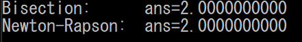

# 問6 数値解析
方程式$x^2-4=0$を二分法、およびNewton-Rapson法でそれぞれ数値的に解く。

---

## main.c
```C
#include <stdio.h>
#include <math.h>
#include "../include/sub.h"

#define B_1 1.9
#define B_2 2.5
#define X_0 2.1
#define N 100

void Bisection(double a, double b);
void Newton_Rapson(double x_0);

int main(void)
{
    Bisection(B_1, B_2);
    Newton_Rapson(X_0);

    return 0;
}

void Bisection(double a, double b)
{
    double c;

    if(F(a)==0)
    {
        printf("Bisection:\tans=%.10f\n", a);
    }
    else if(F(b)==0)
    {
        printf("Bisection:\tans=%.10f\n", b);
    }
    else if(F(a)*F(b)>0)
    {
        printf("Bisection:\tError\n");
    }
    else
    {
        for (int i=0;i<N;i++)
        {
            c = (a + b)/2.0;
            if(F(a)*F(c)<0)
            {
                b = c;
            }
            else
            {
                a = c;
            }
        }

        printf("Bisection:\tans=%.10f\n", c);
    }
}

void Newton_Rapson(double x_0)
{
    double x_1;
    for (int i=0;i<N;i++)
    {
        if(abs(dF(x_0))<1.0e-10)
        {
            printf("Newton-Rapson:\tError\n");
            return;
        }
        x_1 = x_0 - F(x_0)/dF(x_0);
        x_0 = x_1;
    }
    printf("Newton-Rapson:\tans=%.10f\n", x_1);
}
```
---
## 出力結果

[](./image/result.png)

---
- [問1へ](https://github.com/Kouji-Tanaka/B4_Programming1 "Kouji-Tanaka/B4_Programming1")
- [問2へ](https://github.com/Kouji-Tanaka/B4_Programming2 "Kouji-Tanaka/B4_Programming2")
- [問3へ](https://github.com/Kouji-Tanaka/B4_Programming3 "Kouji-Tanaka/B4_Programming3")
- [問4へ](https://github.com/Kouji-Tanaka/B4_Programming4 "Kouji-Tanaka/B4_Programming4")
- [問5へ](https://github.com/Kouji-Tanaka/B4_Programming5 "Kouji-Tanaka/B4_Programming5")

<div>
    <a href="#">
        [Topへ]
    </a>
</div>
